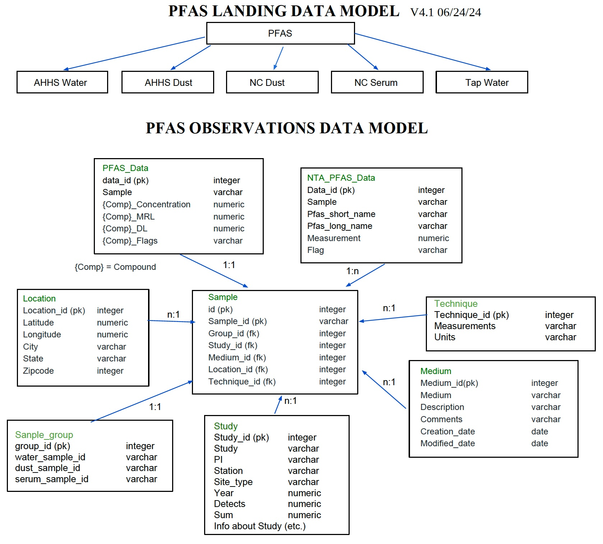
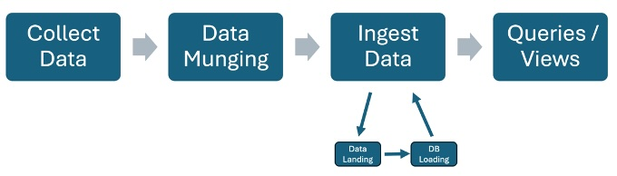
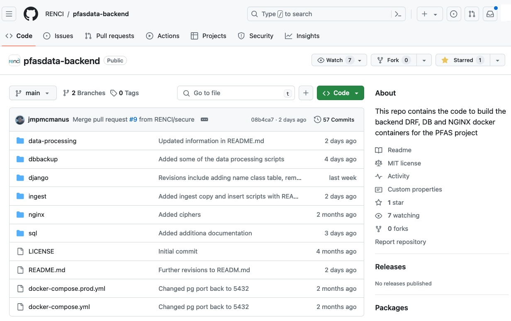

# OPAL (Observational PFAS Access Portal)
# (release v1.0)
# Documentation Overview 

## Introduction
Purpose of this document is to provide an overview of documentation for OPAL (Observational PFAS Access Portal). This includes the data model, the steps taken to ingest and make data available in the PFAS Observational Data Access Tool, information about standing up the tool, as well as eventual pointers to scripts and code related to paper analyses.

Use [https://pfas-app-prod.renci.unc.edu/](https://pfas-app-prod.renci.unc.edu/) to access the data portal directly.

<!--- Comment: May need to add info about the portal being restricted and how to request access. --->

## PFAS Observations Data Model
The PFAS Observations Data Model is based on the Observational Data Model 2 (ODM2) and consists of two elements.  The first element is the landing data model.  This might be termed the pre-database ingest stage of data ingest.  Pre-processed files are provided for the Data Landing stage. More information on workflow can be found in the Data Processing Flow section below. The second element is the more detailed data model for the relational database that provides data to the front-end client.

For more information on ODM2 please consult [https://www.odm2.org](https://www.odm2.org/).

Or refer to the following publication.
[Horsburgh, J. S., Aufdenkampe, A. K., Mayorga, E., Lehnert, K. A., Hsu, L., Song, L., Spackman Jones, A., Damiano, S. G., Tarboton, D. G., Valentine, D., Zaslavsky, I., Whitenack, T. (2016). Observations Data Model 2: A community information model for spatially discrete Earth observations, Environmental Modelling & Software, 79, 55-74, http://dx.doi.org/10.1016/j.envsoft.2016.01.010](http://dx.doi.org/10.1016/j.envsoft.2016.01.010)

## Data Processing Flow
The basic data processing flow is diagrammed below and consists of the following steps:
1.	Raw data are received and working copies made of the files.
2.	Initial processing, aka Data Munging, is conducted using the working copies. (See Initial Data File Processing, aka Data Munging section below for more information)
3.	After initial processing, the data files are staged for the Data Landing.
4.	After staging, scripts are used to load the data into the PFAS Observations.
5.	Queries and data views are developed to support front-end client calls.

## Initial Data File Processing, aka Data Munging
To view a detailed description of the steps taken as part of initial data processing, please consult the following file: [Data_Processing_Steps_Bin.pdf](miscfiles/Data_processing_Steps_Bin.pdf).

Stand-alone R code is accessible in [PFAS_Data_Processing.R](scriptfiles/PFAS_Data_Processing.R)

For data in V1 of OPAL, input data files and post-processed data files are as follows:

| File From EPA                        |  Processed File for Data Landing (Initial Ingest) |
| ------------------------------------ | ------------------------------------------------- |
| AHHS_Dust_DataCleaned_231020.nmd.csv | AHHS_Dust_DataCleaned_231020_nmd_Column.csv       |
| AHHS_Water_DataCleaned_231020_nmd.csv | AHHS_Water_DataCleaned_231020_nmd_Column.csv     |
| AHHSNontargetedDatasetWater.xlsx | AHHSNontargetedDatasetWater_Column.csv                |
| NCSDust_output.csv | NCSDust_output_Column.csv                                           |
| NCSSerum_output.csv + NCS_Serum_Dust_crosswalk_share.csv | 	NCSSerum_output_Column_Corrected_SampleID.csv |

## Data Ingest File Templates
The processed files for Data Landing stage can be used as templates for future data assimilation. Use the file that most closely aligns with your data. See table below.

|  Template File for Data Landing (Initial Ingest)  |
| ------------------------------------------------- |
| [Template_AHHS_Dust_DataCleaned_Column.xlsx](templates/Template_AHHS_Dust_DataCleaned_Column.xlsx)        |
| [Template_AHHS_Water_DataCleaned_Column.xlsx](templates/Template_AHHS_Water_DataCleaned_Column.xlsx)       |
|[Template_AHHSNontargetedDatasetWater_Column.xlsx](templates/Template_AHHSNontargetedDatasetWater_Column.xlsx)               |
| [NCSDust_output_Column.xlsx](templates/NCSDust_output_Column.xlsx)                                           |
| [NCSSerum_output_Column_Corrected_SampleID.xlsx](templates/NCSSerum_output_Column_Corrected_SampleID.xlsx) |

## Data Dictionary
A data dictionary describing the relevant attributes of OPAL V1 will be available shortly.

## Standing Up OPAL v1
Documentation for database ingest and processing, as well as standing up OPAL va, can be found in the following Github repository (https://github.com/RENCI/pfasdata-backend). 

## Database Backups and Data Integrity
To maintain data integrity and security, regular backups are made of the database. For more information see details in Github repository reference in previous section.

## Additional Scripts and Programs for Processing or Analysis

As additional processing, analytical, or other relevant scripts and programs are developed (e.g. for papers in development) they will be made available as appropriate.

Scripts for exploratory analysis, such as R code, are available on request and are being stored in the project MS Teams space.

### Acknowledgements
This was developed under funding from the U.S. EPA under Contract 68HERD21A0002 Task Order 68HERH23F0157 to the University of North Carolina at Chapel Hill by the [UNC Institute for the Environment (UNC-IE)](https://ie.unc.edu/), [Renaissance Computing Institute (RENCI)](https://renci.org/) and the [School of Information and Library Science (SILS)](https://sils.unc.edu/).

