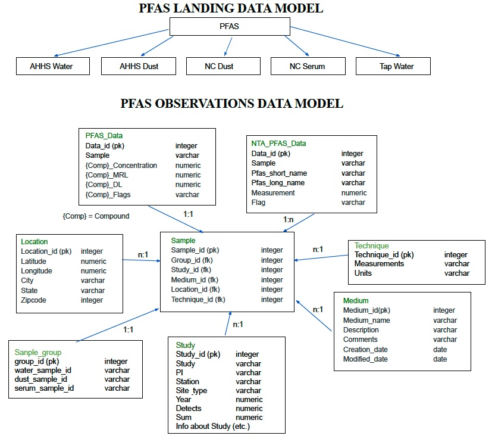

# OPAL (Observational PFAS Access Portal)
# Documentation Overview

## Introduction
Purpose of this document is to provide an overview of documentation for OPAL (Observational PFAS Access Portal). This includes the data model, the steps taken to ingest and make data available in the PFAS Observational Data Access Tool, information about standing up the tool, as well as pointers to scripts and code related to paper analyses.

## PFAS Observations Data Model
The PFAS Observations Data Model is based on the Observational Data Model 2 (ODM2) and consists of two elements.  The first element is the landing data model.  This might be termed the pre-database ingest stage of data ingest.  Pre-processed files are provided for the Data Landing stage. More information on workflow can be found in the Data Processing Flow section below. The second element is the more detailed data model for the relational database that provides data to the front-end client.

## Data Processing Flow
The basic data processing flow is diagrammed in Figure 2 and consists of the following steps:
1.	Raw data are received and working copies made of the files.
2.	Initial processing, aka Data Munging, is conducted using the working copies. (See Initial Data File Processing, aka Data Munging section below for more information)
3.	After initial processing, the data files are staged for the Data Landing.
4.	After staging, scripts are used to load the data into the PFAS Observations.
5.	Queries and data views are developed to support front-end client calls.

## Initial Data File Processing, aka Data Munging
To view a detailed description of the steps taken as part of intiail data processing, please consult the following file: [Data_Processing_Steps_Bin.pdf](docs/miscfiles/Data_processing_Steps_Bin.pdf).

Stand-alone R code are accessible in [PFAS_Data_Processing.R](docs/scriptfiles/PFAS_Data_Processing.R)

## Data Ingest File Templates
The processed files for Data Landing stage can be used as templates for future data assimilation. Use the file that most closely aligns with your data. 
## Data Dictionary
A data dictionary describing the relevant attributes is available.

## Database Ingest Processing
Documentation for database ingest and processing can be found in the following Github repository. 

## Database Backups and Data Integrity
To maintain data integrity and security, regular backups are made of the database. For more information see details in Github repository reference in previous section.

## Additional Scripts and Programs for Processing or Analysis

As additional processing, analytical, or other relevant scripts and programs are developed (e.g. for papers in development) they will be made available as appropriate.

Scripts for exploratory analysis, such as R code, are available on request and are being stored in the project MS Teams space.

